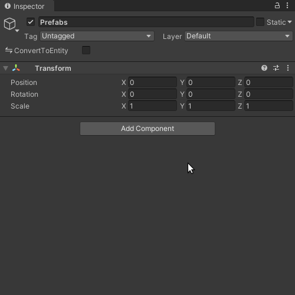

# Reese's Entity Prefab Groups

Create and reference groups of entity prefabs with ease.

## Import

Copy one of the below Git URLs:

* **HTTPS:** `https://github.com/reeseschultz/ReeseUnityDemos.git#epg`
* **SSH:** `git@github.com:reeseschultz/ReeseUnityDemos.git#epg`

Then go to `Window ⇒ Package Manager` in the editor. Press the `+` symbol in the top-left corner, and then click on `Add package from git URL`. Paste the text you copied and finally click `Add`.

## Usage

This package lets you create entity prefab groups—groups of prefabs converted into entities.

For a deep dive on using this package to spawn prefabs, see [this blog post](https://reese.codes/blog/post/spawning-prefabs-with-unity-dots/).

A group is great for organizational purposes. Perhaps all weapons belong in the `Weapons` group, or maybe you'll have a `Characters` group for your players and NPCs. What's more, this package enables you to get a `DynamicBuffer` of all prefab entities belonging to a given group. One good reason to use this package is if you want to select a random prefab from a group of variants.

To get started, create an empty GameObject in a scene.


Next, add a `PrefabEntityGroup` component to said GameObject. Doing so will automatically add the `ConvertToEntity` script to this GameObject with the *Convert And Destroy* conversion mode, which is what you want. Then add prefabs to the group's list.



Your prefabs and their children do *not* need `ConvertToEntity` scripts on them; however, you *can* supply authoring (`IConvertGameObjectToEntity`) scripts for them. This is recommended so that they have queryable, custom components attached to their entity conversions. Unity's existing procedures will take care of references between prefab members and GameObjects that are converted into entities, making it easy to read/write multiple entities with one "controller" component in a system.

Also, note the *Collect Other Prefabs* option, which is true by default. If true, it will collect prefabs from other authoring scripts (attached to the same GameObject) into the group. This is useful when you want to get specific entities from a component via individual fields, and *additionally* want to iterate through them via buffer in certain circumstances. This is so you don't have to manually add them to the group's prefab list yourself.

Anyway, with an entity prefab group, you can do something like this:

```csharp
using Reese.EntityPrefabGroups;
using Unity.Entities;
using Unity.Collections;

public class SomeSystem : SystemBase
{
    protected override void OnUpdate()
    {
        // Get a single entity prefab with a singleton component type:
        Entity donutShop = EntityManager.GetPrefab<DonutShop>();

        ...

        // Perhaps more usefully, directly get the DonutShop component:
        DonutShop donutShopComponent = EntityManager.GetSingleton<DonutShop>();

        ...

        // Get a DynamicBuffer of entity prefabs in a group with a singleton component type:
        DynamicBuffer<Entity> hairStyles = EntityManager.GetPrefabs<HairStyles>().Reinterpret<Entity>();

        ...

        // The above assumes that the authoring scripts are attached to the given group.
        // Expect a runtime error if a component doesn't exist, or isn't a singleton.
    } 
}
```

Type inference via `var` is your friend, but the types in this example are explicit for demonstrational purposes.

`GetPrefab`, `GetSingleton`, and `GetPrefabs` are [extension methods](https://reese.codes/blog/post/how-extension-methods-work-in-csharp/) for the `EntityManager`, which come with this package. The `PrefabGroup` dynamic buffer is what's actually returned by `GetPrefabs`, but it's hidden by `Entity` reinterpretation. Entity conversion has never been so terse and tenable for tens, hundreds, and even thousands of prefabs. One great property of this system is that you are free to update the `PrefabGroup` at runtime, which you may need for streaming.

## Behind the Scenes

Each group is effectively an entity with a `DynamicBuffer<PrefabGroup>` component. During conversion, referenced prefabs are added to that buffer as entities. Assuming the group has a singleton component attached to it, you can get it with the shortened expressive power of the `GetPrefabs` extension method, as opposed to writing the query, and fetching the buffer, yourself. By the way, the singular `GetPrefab` does not actually require any `EntityPrefabGroup` in your scene, and will work without it. The same is true of `GetSingleton`.

## Contributing

Find a problem, or have an improvement in mind? Great. Go ahead and submit a pull request. Note that the maintainer, Reese, offers no assurance he will respond to you, fix bugs or add features on your behalf in a timely fashion, if ever, [unless you reach an agreement with him about support.](https://reese.codes)

By submitting a pull request, you agree to license your work under [this project's MIT license](https://github.com/reeseschultz/ReeseUnityDemos/blob/master/LICENSE).
